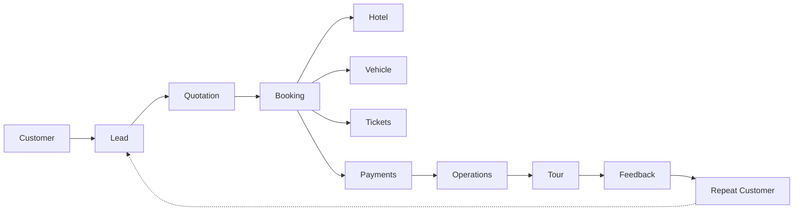

# 01 — Vision

> **Status:** Living document
> **Last updated:** 2026-07-25

## Mission

Build one software where a travel agency can manage its entire business — no Excel, no manual diaries, no WhatsApp-tracked leads, no Word-doc quotations. Everything from first customer contact to repeat booking happens inside one platform.

We are not building a booking website with an admin panel bolted on. We are building the **operating system a travel agency runs its business on**. The public website is one surface of that system — a small one. The Admin Panel is the heart of the product, and it should eventually be where every business operation happens.

## The problem, precisely

Travel agencies — especially small and medium ones — are underserved by software today. They run on:

- **Excel / Google Sheets** for tracking bookings, payments, and inventory
- **WhatsApp** for both customer communication and internal staff coordination
- **Paper diaries and notebooks** for itineraries and day-to-day schedules
- **Word documents** for quotations, re-typed by hand for every customer
- **Phone calls** with no durable record of what was discussed or promised

The result: nothing is connected, nothing is searchable, institutional knowledge lives in one person's head, and the business cannot scale past what a single overworked owner can personally track.

## The vision, as a flow

Every customer interaction should be traceable through one continuous pipeline instead of scattered across five tools:

Nothing in that chain should require leaving the platform. A lead captured today should be traceable, without asking anyone, all the way to whether that same person books again next year.

## Product philosophy

1. **This is not "just another CRUD app."** Every module must solve a real, named business problem an agency owner or staff member actually has — not a generic feature because "CRMs usually have this."
2. **Every screen should save time.** If a screen doesn't remove work a staff member currently does manually, question why it exists.
3. **Every module should reduce manual work**, not add a new place to re-enter the same data.
4. **Every workflow should increase productivity** — measured against the manual (Excel/WhatsApp/paper) alternative it replaces.
5. **The software becomes the operating system**, not a peripheral tool staff use alongside their spreadsheets. Full adoption is the goal, not partial digitization.

## Technical philosophy

The codebase must, from day one, be:

- **Production-ready** — no demo-quality shortcuts, even in early modules
- **Scalable** — designed knowing usage and tenant count will grow
- **Maintainable** — code a future engineer (or future you) can safely change
- **Modular** — new modules integrate with existing ones rather than replacing them
- **Secure** — data belongs to real businesses and real customers; treat it accordingly
- **Testable** — correctness verified by tests, not just manual spot-checks
- **Enterprise-grade** — hold to this bar even while the customer base is still small

We never implement temporary solutions and patch them "for now." We always design for where the product is going, thinking roughly five years ahead, even when shipping something small today.

## Strategic sequencing: why one real tenant first

The vision above describes a multi-tenant SaaS product. But the current implementation is deliberately single-tenant, built for one real business — **Sainath Holidays** (see [00_PROJECT_OVERVIEW.md](./00_PROJECT_OVERVIEW.md) for the platform/tenant distinction).

This is intentional, not a limitation to apologize for: workflows designed against a real business's real problems are far more likely to be correct than workflows designed speculatively for a hypothetical generic agency. The plan is to prove the CRM → Sales → Finance → Operations loop end-to-end against Sainath Holidays' actual operations, and only then retrofit multi-tenancy (see [03_ROADMAP.md](./03_ROADMAP.md)) so other agencies can run the same platform in isolation.

## What "done" looks like

There is no fixed finish line — the roadmap in [03_ROADMAP.md](./03_ROADMAP.md) is phased and will keep extending — but the north star is:

An agency owner opens TravelERP each morning and never needs to open Excel, WhatsApp Business, or a paper diary to run their business. Every lead, quotation, booking, vendor payment, staff task, and customer relationship lives in one system, and every future module (Finance, Marketing, Analytics, AI) makes that owner's day measurably shorter.

## Non-goals

To keep this vision from sprawling into "software for everything":

- This is **not** a generic project-management or CRM tool retrofitted for travel — every feature is designed travel-agency-first.
- The public website is **not** the product — it is one input channel (leads, bookings) into the real product, the Admin Panel / business OS.
- We are **not** optimizing for a demo or portfolio piece — every module ships at the production-quality bar described above, even the first version.
