# 06 — System Architecture

> **Status:** Living document
> **Last updated:** 2026-07-25

This document defines the target system architecture for **TravelERP** — the final-product architecture, not a description of the ~10–15% currently implemented (see [00_PROJECT_OVERVIEW.md](./00_PROJECT_OVERVIEW.md)). It is the reference every future engineering decision should be checked against. Product scope lives in [02_PRODUCT.md](./02_PRODUCT.md), sequencing lives in [03_ROADMAP.md](./03_ROADMAP.md); this document is the "how it's built," not the "what" or "when."

No code is included by design — this is a structural and decision-rationale document. Implementation specifics belong in future per-module docs (reserved `07`–`17` range).

---

## 1. Purpose of the Architecture

This architecture exists to answer one question consistently, for every module built from here forward: **"Where does this belong, and how does it talk to everything else?"** Without an explicit answer, a growing module catalog (CRM, Sales, Finance, Vendor, Operations, Marketing, Analytics, AI, Enterprise — [02_PRODUCT.md](./02_PRODUCT.md)) turns into a tangle of ad-hoc cross-references that nobody can safely change.

Three principles govern every decision in this document:

1. **Boring, proven technology over novel technology.** A travel agency ERP does not need to be a technology showcase. Every unfamiliar piece of infrastructure is a 3am liability. We reach for something exotic only when a proven alternative demonstrably can't do the job.
2. **Design for thousands of tenants, build for one first.** The architecture must not assume there will only ever be one tenant (Sainath Holidays) — but the *business feature* rollout deliberately serves that one real tenant first ([01_VISION.md](./01_VISION.md#strategic-sequencing-why-one-real-tenant-first)). This document reconciles that tension explicitly in [§18](#18-multi-tenant-readiness).
3. **Evolve without rewrites.** Every boundary drawn here (module boundaries, adapter interfaces, event-driven decoupling) exists so that later scaling decisions — extracting a service, swapping a vendor, adding a message broker — are additive changes, not rewrites. See [§20](#20-future-architecture-evolution).

---

## 2. High-Level System Overview

At the highest level, TravelERP is three layers:

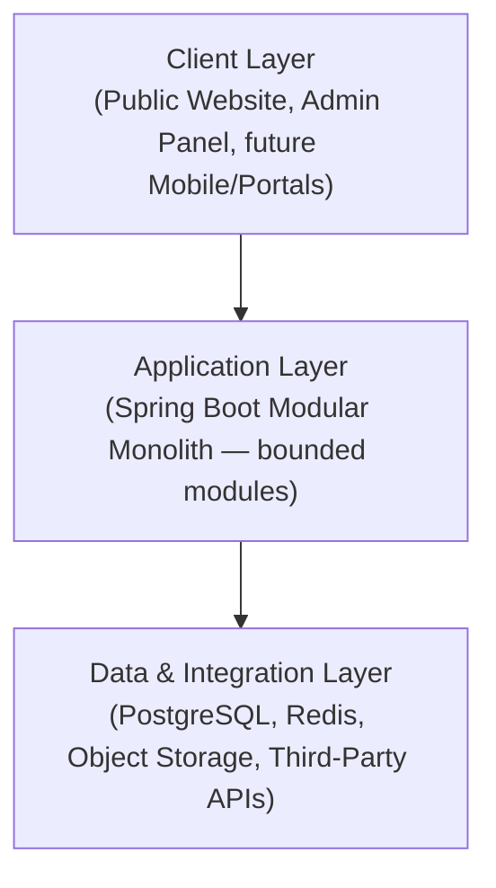

**Why a modular monolith, not microservices, at this stage:** microservices earn their operational cost (independent deploys, network reliability, distributed tracing, service discovery) only when a team is large enough that shared-codebase coordination is the bottleneck, or when a specific module has genuinely divergent scaling needs. Neither is true here yet. A modular monolith — one deployable Spring Boot application internally organized into strict bounded modules — gives 90% of the benefit people reach for microservices for (clear ownership boundaries, independent reasoning about each module) at a fraction of the operational cost. [§20](#20-future-architecture-evolution) describes exactly which modules are the first credible candidates for extraction, and what has to be true before that's worth doing.

---

## 3. Overall Architecture Diagram

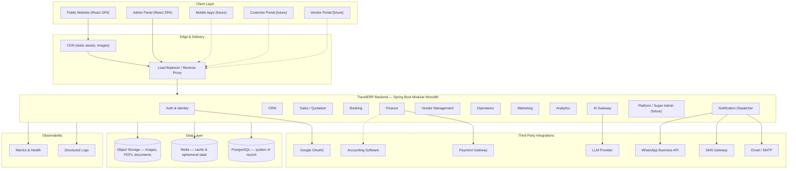

Dashed lines mark connections that don't exist yet (future clients/integrations); solid lines are architecturally load-bearing today or in the near-term roadmap.

---

## 4. Frontend Architecture

**Decision:** One React 18 + TypeScript + Vite single-page application serving both the Public Website and the Admin Panel, split by route, not by deployable app.

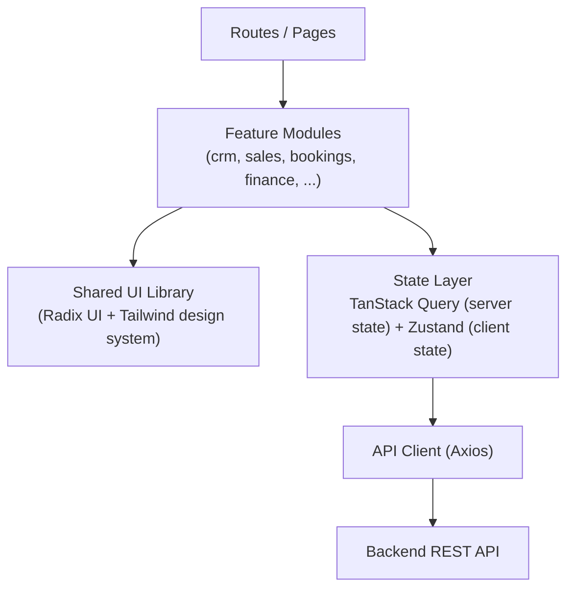

**Why one SPA, not two:** the Admin Panel and Public Website today share auth, design system, and deployment cadence — splitting them would duplicate all three for no present benefit. Split only when a real forcing function appears (e.g. the public site needs SEO-driven server-side rendering and the Admin Panel doesn't — see below).

**Component & state conventions to hold as the module catalog grows:**
- **Feature-based folders**, one per product module, mirroring [02_PRODUCT.md](./02_PRODUCT.md)'s catalog — already the established pattern, keep it.
- **Module-scoped Zustand stores**, not one global store. A CRM pipeline-view store and a Finance ledger-view store have no reason to share a slice; a single global store becomes an unreviewable bottleneck as modules multiply.
- **TanStack Query as the only source of server state.** Never duplicate server data into Zustand — Zustand is for client-only UI state (open panels, wizard steps, theme).
- **Shared UI library extraction**, formalized once two or more modules need the same non-trivial primitive (data tables, Kanban boards for the CRM pipeline, calendar views for Operations). Don't extract prematurely from a single usage.
- **Form validation via a shared schema layer** (e.g. Zod), ideally kept in lockstep with backend request DTOs so validation rules aren't hand-duplicated in two languages.

**Rendering strategy:** client-side rendering (CSR) is correct for the Admin Panel (no SEO need, behind auth). The Public Website is the one place SSR/static-generation is worth revisiting if organic search becomes a real acquisition channel — track this as a future decision, not a default.

---

## 5. Backend Architecture

**Decision:** Spring Boot 3, organized **package-by-feature** (one package per product module — `crm`, `sales`, `booking`, `finance`, `vendor`, `operations`, `marketing`, `analytics`, `ai`, `platform`), each internally layered Controller → Service → Repository → Entity.

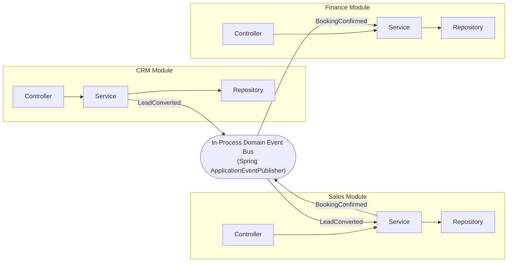

**Why modules never call each other's repositories directly:** a module's entities and repositories are its private implementation detail. Other modules interact with it only through its service-layer interface (backed by DTOs, the same MapStruct-based boundary already used for API responses). This is what makes it possible to later extract a module into its own service without a rewrite — the internal call becomes a network call behind the same interface.

**Why an in-process domain event bus, not a message broker, today:** cross-module reactions are common in this domain — a confirmed Booking should trigger Finance to open a payment schedule, Operations to create pre-tour tasks, and Marketing to schedule a post-tour feedback request, without the Booking module knowing any of that. Spring's `ApplicationEventPublisher` (with `@TransactionalEventListener` so listeners only fire after a successful commit) gives that decoupling today with zero new infrastructure. The upgrade path to a real broker (Kafka/RabbitMQ) — needed once work must survive process restarts independently or fan out across multiple instances — is a like-for-like swap of the event-publishing mechanism, not a redesign; see [§20](#20-future-architecture-evolution).

**Cross-cutting concerns** (JWT authentication, tenant resolution, correlation-ID logging, global exception handling) are implemented once, as filters/interceptors/`@ControllerAdvice`, and apply uniformly to every module — no module reimplements auth or error shaping itself.

---

## 6. Database Layer

**Decision:** A single PostgreSQL cluster as the system of record, using a **shared-database, shared-schema** model with a `tenant_id` discriminator column on every tenant-owned table, enforced additionally by **PostgreSQL Row-Level Security (RLS)**.

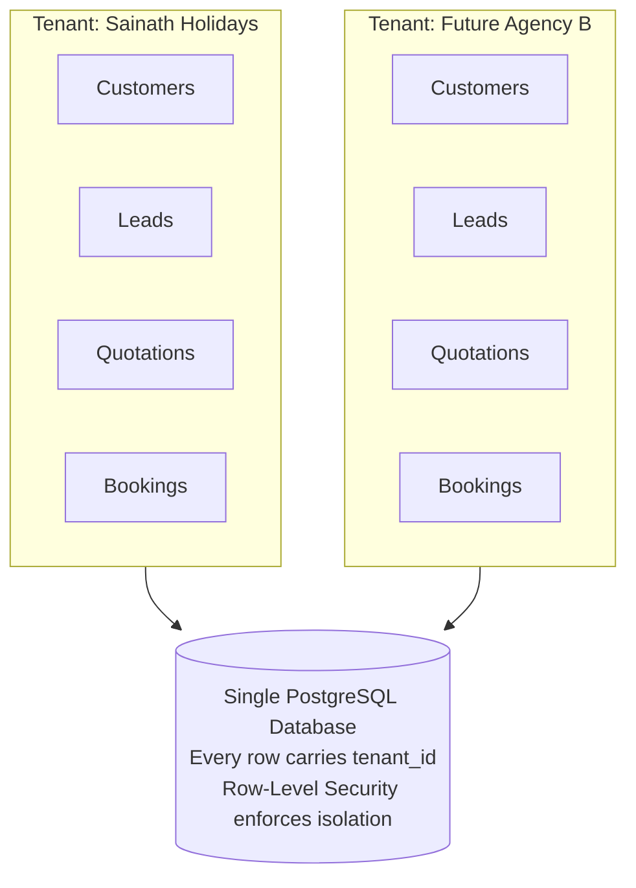

**Why shared-schema over schema-per-tenant or database-per-tenant:** at the scale this product targets — many small-to-medium agencies, each with a modest data footprint — schema-per-tenant means running every migration hundreds or thousands of times and multiplies operational surface area for no isolation benefit most tenants need. Shared-schema with RLS gives strong, DB-enforced isolation (not just "the application remembered to filter by tenant_id") while keeping one schema to migrate and one place to run cross-tenant analytics for the Platform layer. **Dedicated schema-per-tenant is kept as an opt-in Enterprise-tier capability** for large customers who require it contractually — not the default.

**Other standing conventions:**
- **Versioned migrations (Flyway)** replace the current dev-only `ddl-auto=create-drop` + `seed.sql` approach before any real multi-tenant data exists — schema changes must be reproducible and auditable, not regenerated from entities.
- **Foreign keys enforced at the database level**, not just in application code — a correctness guarantee that doesn't depend on every developer remembering to check.
- **`@CreationTimestamp`/`@UpdateTimestamp` auditing and soft-deletes (`isActive`)** as the default for every entity, already the pattern for Packages/Hotels — extend it everywhere.
- **Point-in-time recovery and automated backups are non-negotiable**, not optional infrastructure — this database holds real customer payment and booking data the moment a second tenant signs up.
- **Read replicas** for the Analytics module's reporting queries are the first scaling lever reached for once reporting load contends with transactional load — see [§17](#17-scalability-strategy).

---

## 7. Authentication Flow

**Decision:** Stateless JWT (short-lived access token + rotating refresh token), supporting email/password, phone OTP, and Google OAuth2 — the pattern already implemented, formalized as the standing approach.

```mermaid
sequenceDiagram
    actor U as User
    participant FE as "Frontend (SPA)"
    participant Auth as "Auth Module"
    participant Redis as "Redis (OTP store)"
    participant Google as "Google OAuth2"
    participant DB as "PostgreSQL"

    alt Email + Password
        U->>FE: Enter email/password
        FE->>Auth: POST /auth/login
        Auth->>DB: Verify credentials
        DB-->>Auth: User record
        Auth-->>FE: Access + Refresh JWT
    else Phone + OTP
        U->>FE: Enter phone number
        FE->>Auth: POST /auth/otp/send
        Auth->>Redis: Store OTP (TTL 5 min)
        Auth-->>U: OTP delivered via SMS
        U->>FE: Enter OTP
        FE->>Auth: POST /auth/otp/verify
        Auth->>Redis: Validate OTP
        Auth->>DB: Find or create user
        Auth-->>FE: Access + Refresh JWT
    else Google SSO
        U->>FE: Click "Sign in with Google"
        FE->>Google: Redirect to consent screen
        Google-->>Auth: OAuth2 callback with profile
        Auth->>DB: Find or create user
        Auth-->>FE: Access + Refresh JWT
    end

    FE->>FE: Store tokens; attach Access JWT to all future requests

    Note over FE,Auth: When Access JWT expires
    FE->>Auth: POST /auth/refresh (Refresh JWT)
    Auth->>DB: Validate & rotate refresh token
    Auth-->>FE: New Access + Refresh JWT
```

**Why stateless JWT over server-side sessions:** no session store to keep consistent across horizontally scaled instances — any instance can validate any request by checking the token's signature alone. **Why refresh-token rotation:** a stolen refresh token that's already been used is detectably invalid the next time the real client tries to use it, limiting the blast radius of leaked tokens.

**Multi-tenant evolution:** once tenancy activates, the JWT gains a `tenant_id` claim at issuance, so every downstream request resolves its tenant with zero extra lookups — see [§18](#18-multi-tenant-readiness).

---

## 8. Authorization Flow

**Decision:** Role-based access control today, evolving to permission-based (roles as named bundles of fine-grained permissions) once Enterprise customers need custom roles.

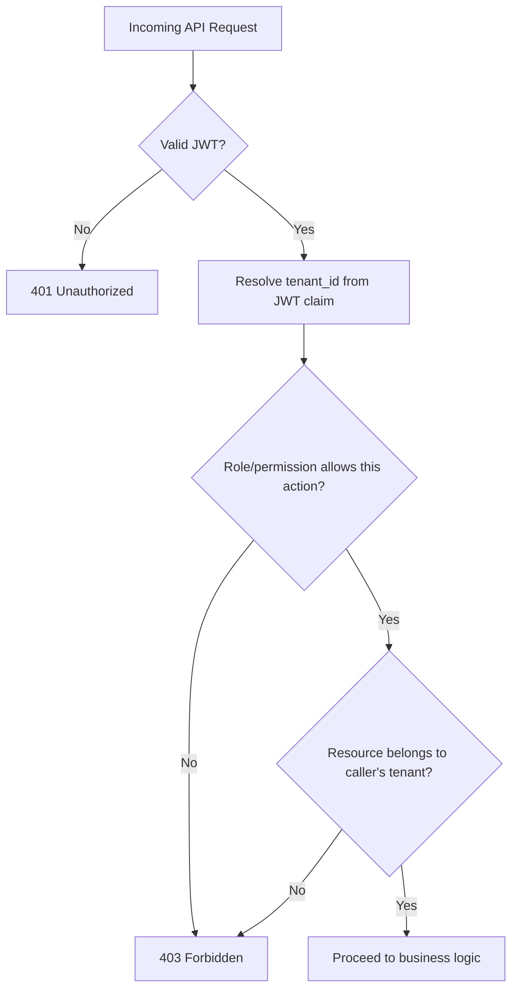

**Why permission-based, eventually, not just role names:** hardcoded roles (`ADMIN`, `USER`) are fine for two roles. [04_USER_ROLES.md](./04_USER_ROLES.md) already anticipates Sales Manager, Sales Executive, Operations, Finance, Support — and Enterprise customers will eventually want to define their *own* role names with a chosen set of permissions. Building on permissions-as-the-atomic-unit from the start of that expansion avoids a rewrite later; roles simply become named, editable permission sets.

**The ownership check is not optional even for correctly-scoped queries:** every resource-by-ID lookup must verify the resource's `tenant_id` matches the caller's, even though list endpoints already filter by tenant — defense in depth against an ID-guessing cross-tenant access attempt.

---

## 9. API Communication Flow

**Decision:** REST + JSON, versioned (`/api/v1/...`), documented via OpenAPI/Swagger as the contract of record, wrapped in a consistent `ApiResponse<T>` envelope — the pattern already in place, held as the standard going forward.

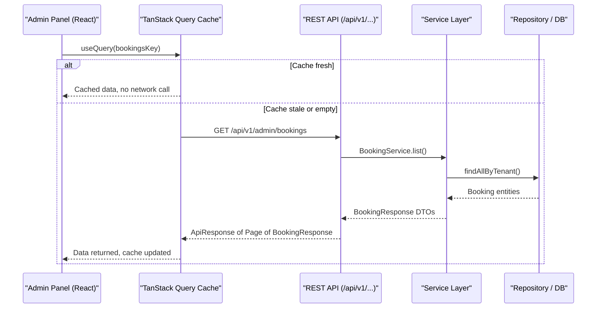

**Why REST over GraphQL, for now:** the Admin Panel's data-fetching needs today are page-shaped, not graph-shaped — TanStack Query plus well-designed REST endpoints handles pagination, filtering, and caching cleanly. Revisit only if nested-data over-fetching genuinely becomes a measured problem, not preemptively.

**Outbound webhooks** become necessary once third-party integrations call back into TravelERP (Payment Gateway payment-status callbacks, WhatsApp delivery receipts) — these should land on dedicated, signature-verified webhook endpoints, never reuse a normal authenticated route for inbound vendor callbacks.

**API versioning discipline matters more here than in most internal systems**, because the Enterprise phase's Public API ([02_PRODUCT.md](./02_PRODUCT.md)) means external integrators will eventually depend on this contract not breaking silently.

---

## 10. File Storage Strategy

**Decision:** Object storage (S3-compatible), never local disk — package/hotel images, quotation PDFs, and customer documents (ID proofs, visa paperwork) all live here.

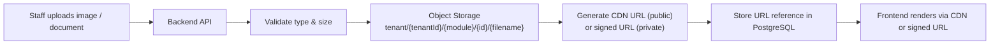

**Why not local disk:** local disk ties uploaded files to one specific server instance, which breaks the moment there's more than one app instance behind a load balancer — a hard blocker for [§17](#17-scalability-strategy)'s horizontal scaling.

**Why tenant-prefixed object keys from day one:** even with a single tenant today, storing every file under `tenant/{tenantId}/...` means a future "export all my data" or "delete this tenant's data" operation is a prefix operation, not a forensic search. Retrofit-free multi-tenancy applies to storage exactly as it applies to the database ([§18](#18-multi-tenant-readiness)).

**Public vs. private assets:** package/hotel marketing images are public, served through a CDN for speed and cost. Customer documents and generated invoices are private, served only via short-lived signed URLs, never a permanently public path.

---

## 11. Notification Architecture

**Decision:** A single internal **Notification Dispatcher** that every module calls through — never a direct SMTP/SMS/WhatsApp SDK call from business logic.

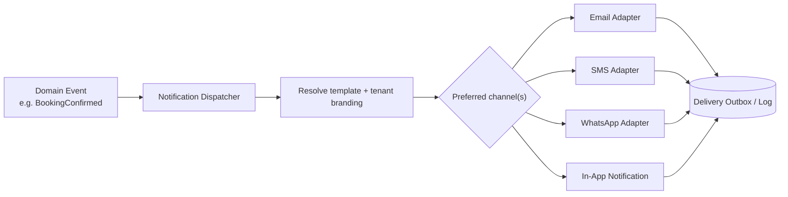

**Why a dispatcher abstraction, not per-module vendor calls:** the Booking module confirming a booking should emit a `BookingConfirmed` event and be done — it should never need to know whether the resulting notification goes by email, SMS, or WhatsApp, or which vendor SDK sends it. This is what lets the Marketing module later add a WhatsApp channel, or lets the business swap SMS providers, without touching Booking, Finance, or Operations code.

**Why delivery goes through an outbox, not a fire-and-forget call:** a notification send should never block the request that triggered it (a booking confirmation shouldn't wait on an email server), and a failed send must be visible and retryable rather than silently lost. A persisted outbox table, drained asynchronously (`@Async` today; a real queue once multi-instance ordering matters — [§20](#20-future-architecture-evolution)), gives both properties.

---

## 12. AI Integration Layer

**Decision:** All AI-powered features ([02_PRODUCT.md](./02_PRODUCT.md)'s AI module) go through a single internal **AI Gateway** — no module calls an LLM provider's SDK directly.

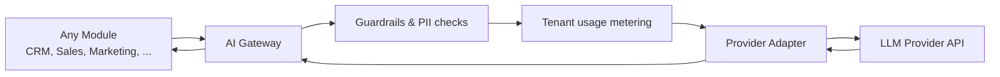

**Why a gateway, not direct SDK calls scattered across modules:** four things need to happen consistently for *every* AI feature, and belong in exactly one place:
1. **Provider abstraction** — the specific LLM vendor is an implementation detail behind an adapter interface, swappable without touching Sales/CRM/Marketing code.
2. **Tenant usage metering** — AI features are naturally usage-priced (e.g. "N AI quotation generations per month" as part of a subscription tier, [02_PRODUCT.md](./02_PRODUCT.md)); the gateway is the only correct place to count and enforce that.
3. **Guardrails and PII handling** — some tenants will have compliance concerns about customer data leaving their instance; a per-tenant AI opt-in/out and PII-redaction policy has to be enforced centrally, not hoped for in each module's prompt-construction code.
4. **Prompt versioning and observability** — one place to see what was actually sent to the model and why a generation looked the way it did, essential for debugging AI-generated quotations customers actually see.

---

## 13. Third-Party Integrations

| Integration | Purpose | Owning Module | Status |
|---|---|---|---|
| Google OAuth2 | SSO login | Auth | Implemented |
| Email/SMTP | OTP delivery, transactional email | Notification | Implemented |
| SMS Gateway | OTP fallback, transactional SMS | Notification | Planned (placeholder exists) |
| WhatsApp Business API | Customer communication, marketing | Notification / Marketing | Planned |
| Payment Gateway | Online payment collection, installments | Finance | Planned — required for [Finance Core](./03_ROADMAP.md#phase-3--finance-core) |
| Accounting Software (Tally / Zoho Books / QuickBooks-class) | Accounting integration, GST | Finance | Planned |
| Maps / Geocoding | Package location display | Public Website | Implemented (OpenStreetMap/Leaflet — deliberately not Google Maps, avoiding per-load billing at scale) |
| LLM Provider | AI features | AI Gateway | Planned |

**Standing rule:** every third-party integration is accessed through a category-specific adapter interface (a `PaymentProvider` interface, a `MessagingProvider` interface, an `AccountingProvider` interface) — the same discipline as [§11](#11-notification-architecture) and [§12](#12-ai-integration-layer). Business logic depends on the interface, never the vendor SDK directly. This is the single most important rule in this document for keeping vendor lock-in a business decision instead of an accidental architectural one.

**Resilience:** every outbound call to a third party is wrapped with a retry-with-backoff and circuit-breaker policy (e.g. Resilience4j) so a flaky payment gateway or WhatsApp API outage degrades gracefully instead of cascading into a full outage — detailed further in [§16](#16-error-handling-architecture).

---

## 14. Caching Strategy

**Decision:** Redis serves two roles — ephemeral state (OTPs, refresh-token denylists, rate-limit counters) and read-through application cache for expensive, infrequently-changing reads (public package/hotel/vehicle listings).

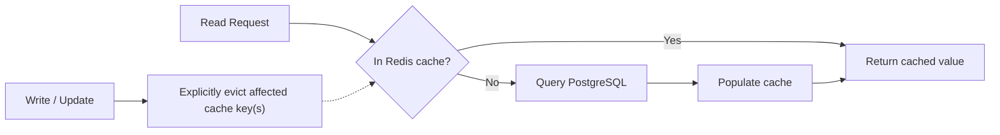

**Why explicit invalidation-on-write, not TTL alone:** relying purely on a time-to-live means a staff member editing a package in the Admin Panel might not see their own change reflected on the public site for the length of the TTL. Explicit eviction on every write keeps the cache correct; TTL remains a safety net for cases an eviction was missed, not the primary mechanism.

**Multi-tenant cache keys are mandatory the moment tenancy activates:** every cache key must be tenant-scoped (`tenant:{tenantId}:packages:list`), or one tenant's cached data can leak into another tenant's response — this is the same discipline as [§10](#10-file-storage-strategy)'s tenant-prefixed object keys.

---

## 15. Logging Strategy

**Decision:** Structured (JSON) logs in every environment above local dev, every log line carrying a request correlation ID, and — once tenancy activates — a `tenant_id`.

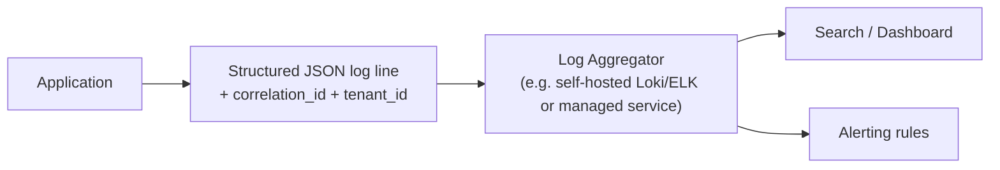

**Why structured logs, not human-readable text:** once there is more than one tenant and more than one server instance, grep-ing raw text logs stops working. A structured line is queryable — "show me every error for tenant X in the last hour" is a query, not a manual search.

**Why a correlation ID matters more here than in a typical internal tool:** support requests will come in as "my booking confirmation email never arrived" — a correlation ID that threads through the API request, the domain event, and the notification dispatch is the difference between a five-minute diagnosis and an unreproducible mystery.

**Log-level discipline is an ongoing practice, not a one-time setting** — production stays at `WARN`/`ERROR` by default with `DEBUG` reserved for targeted, temporary troubleshooting, consistent with the verbosity reduction already done in this codebase's history.

---

## 16. Error Handling Architecture

**Decision:** A single global exception-handling layer (`@ControllerAdvice`) maps every domain exception to a consistent HTTP status and a **stable error code** (not just a human-readable message) inside the existing `ApiResponse<T>` envelope.

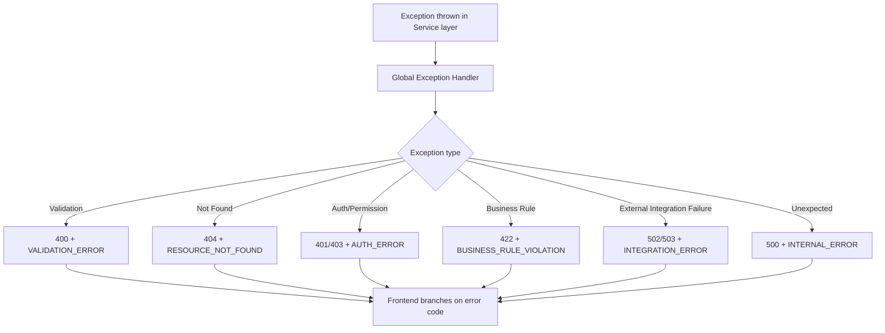

**Why a stable error code, not just an HTTP status and a message:** an HTTP status alone can't distinguish "this discount exceeds your approval limit" from "this booking date has passed" — both might reasonably be `422`. A stable machine-readable code lets the frontend show the right inline message or trigger the right UI behavior (e.g. redirect to an approval-request flow) without parsing English sentences that are free to change wording.

**External integration failures are their own category, deliberately** ([§13](#13-third-party-integrations)) — a payment gateway timeout is not the same class of problem as a validation error, and the frontend (and the on-call engineer) need to know that immediately from the response shape, not by inference.

---

## 17. Scalability Strategy

**Decision:** Scale the boring way, one layer at a time, only when a real signal says to — not preemptively.

| Layer | First scaling lever | Signal to act |
|---|---|---|
| App servers | Horizontal scale — add stateless instances behind a load balancer | Sustained CPU/latency SLO breach |
| Database | Vertical scale, then read replicas for Analytics/reporting queries | Read/write contention, replica lag |
| Cache | Larger Redis instance / Redis cluster | Falling cache hit ratio, memory pressure |
| Async work | Move from in-process events ([§5](#5-backend-architecture)) to a real message broker | Cross-instance ordering needed, event volume grows |
| File storage | None needed — object storage scales inherently | N/A |
| Frontend | CDN + per-module code-splitting already in place | Per-module bundle size growth |

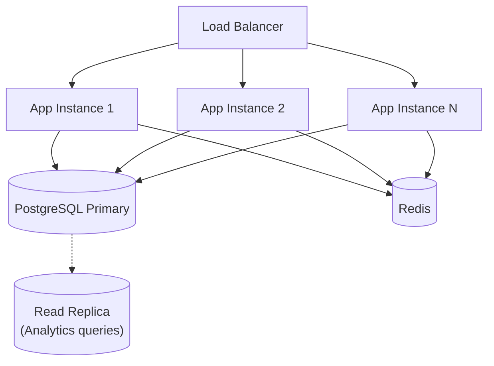

**Why this order, specifically:** the app layer is made horizontally scalable "for free" by the stateless-JWT decision in [§7](#7-authentication-flow) — that lever should be pulled first because it's nearly zero-cost. Database sharding/partitioning by tenant is deliberately *last* on this list: it solves a real problem, but only one this product is unlikely to hit before reaching a tenant count and per-tenant usage level far beyond what schema-per-tenant Enterprise customers would already have opted out into their own isolated schema for. Reaching for it early is solving a problem the business doesn't have yet at the cost of real complexity it would carry forever.

---

## 18. Multi-Tenant Readiness

This section reconciles the tension named in [§1](#1-purpose-of-the-architecture): [03_ROADMAP.md](./03_ROADMAP.md) deliberately sequences the full multi-tenancy *business* rollout — the Platform/Super Admin layer, tenant self-service onboarding, billing — as [Phase 6](./03_ROADMAP.md#phase-6--multi-tenancy-retrofit), after CRM/Sales/Finance/Operations/Vendor Management are proven against Sainath Holidays. That sequencing is still correct. What it should **not** mean is that the *schema* stays tenant-unaware until Phase 6 arrives.

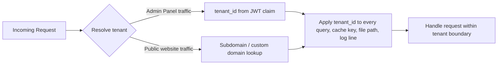

> **Architectural recommendation — worth revisiting [03_ROADMAP.md](./03_ROADMAP.md) over:** add the `tenant_id` column (defaulted to a single "Sainath Holidays" tenant row) to every new table **as it's created** during Phases 1–5, rather than retrofitting it onto years of accumulated tables in one Phase 6 migration. This turns Phase 6 from "a risky big-bang migration against live production data" into "activate Row-Level Security enforcement and build the Platform layer" — the same business sequencing, a much safer engineering path to it. This is a recommendation, not a unilateral change to the roadmap — flag agreement or disagreement and I'll update [03_ROADMAP.md](./03_ROADMAP.md) accordingly.

**Tenant resolution, concretely:**
- **Admin Panel traffic** (always authenticated): tenant resolved from the `tenant_id` claim embedded in the JWT at login — zero extra lookups per request.
- **Public website traffic** (often anonymous): tenant resolved from the subdomain (`agencyname.travelerp.com`) today, with custom-domain mapping added as an Enterprise-tier capability later.
- **Every tenant-scoped resource** — database rows ([§6](#6-database-layer)), cache keys ([§14](#14-caching-strategy)), object storage paths ([§10](#10-file-storage-strategy)), and log lines ([§15](#15-logging-strategy)) — carries the same `tenant_id` discipline. One mental model, applied everywhere, not a special case per subsystem.

---

## 19. Deployment Architecture

**Decision:** Containerized deployment (Docker), promoted through dev → staging → production environments, with production being the only environment serving a real tenant.

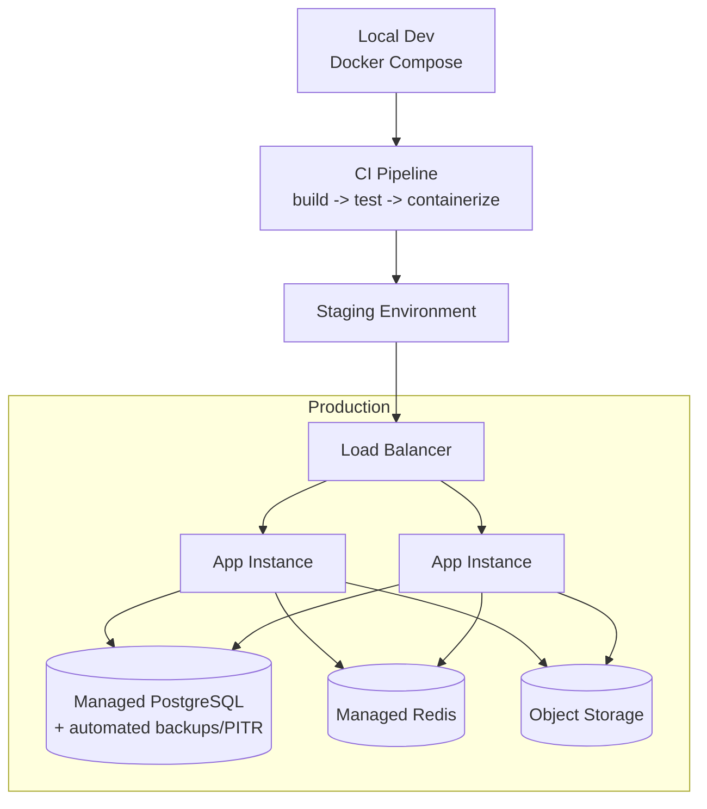

**Why managed infrastructure over self-hosting every layer:** a small team's engineering time is the scarcest resource this product has. Managed Postgres (automated backups, point-in-time recovery), managed Redis, and object storage remove entire categories of operational failure modes (backup misconfiguration, disk-full incidents) that have nothing to do with building the product. Self-hosting is only worth it where cost at scale clearly justifies the added operational ownership — not by default.

**Zero-downtime deploys** follow directly from the stateless-app-instance decision in [§7](#7-authentication-flow)/[§17](#17-scalability-strategy): rolling deployment of new instances behind the load balancer, draining old ones, with no session state to migrate.

**CI/CD**: every change flows through build → automated test → containerize → deploy, the same pipeline regardless of which module changed — no module gets a manual, undocumented release process.

**Infrastructure-as-code** (e.g. Terraform) is a future hygiene practice worth adopting once infrastructure grows past a handful of manually-configured resources — flagged here as a forward-looking recommendation, not a day-one requirement.

---

## 20. Future Architecture Evolution

Every decision in this document was written with a stated upgrade path rather than a hidden ceiling. This section collects them against the business phases in [03_ROADMAP.md](./03_ROADMAP.md) so the two documents stay legible together.

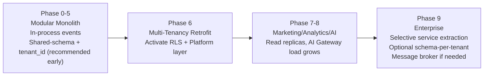

| Today's decision | Evolves to | Trigger |
|---|---|---|
| Modular monolith ([§5](#5-backend-architecture)) | Selective service extraction — AI Gateway and Notification Dispatcher are the first credible candidates | A module needs independent scaling, deploy cadence, or on-call ownership distinct from the rest |
| In-process domain events ([§5](#5-backend-architecture)) | Real message broker (Kafka/RabbitMQ) | Cross-instance coordination or event durability beyond a single process is required |
| Shared-schema + RLS ([§6](#6-database-layer)) | Opt-in schema-per-tenant | A large Enterprise customer contractually requires dedicated isolation |
| REST + TanStack Query ([§9](#9-api-communication-flow)) | GraphQL or a Backend-for-Frontend layer | Admin Panel data-fetching complexity (deep nested joins across modules) measurably outgrows REST |
| Single-region deployment ([§19](#19-deployment-architecture)) | Multi-region | International tenant expansion demands regional data residency or latency |
| CSR-only frontend ([§4](#4-frontend-architecture)) | SSR/static generation for the public site only | Organic search becomes a meaningful acquisition channel |

**The point of this section is not to predict the future precisely** — it's that none of these transitions require undoing a decision made earlier in this document. That property, not any single technology choice, is the actual architecture.
